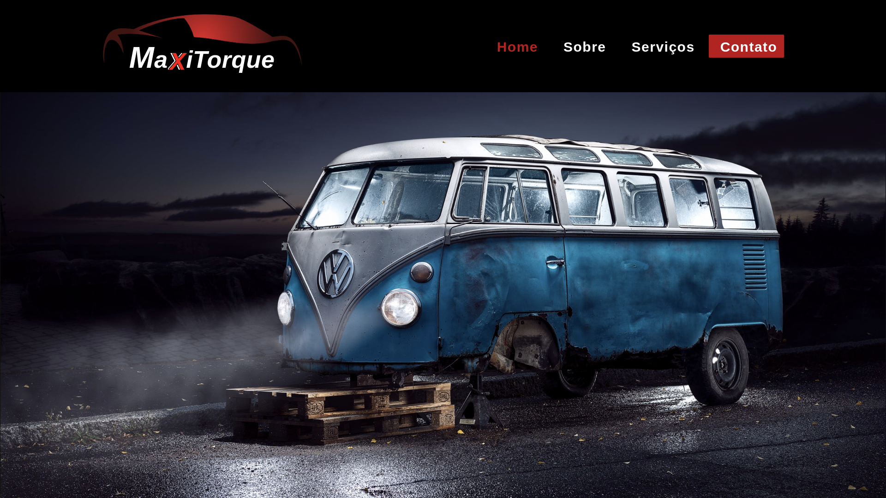
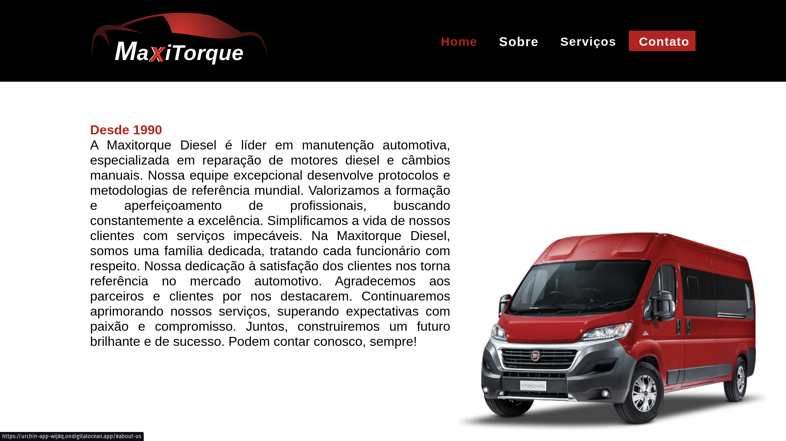
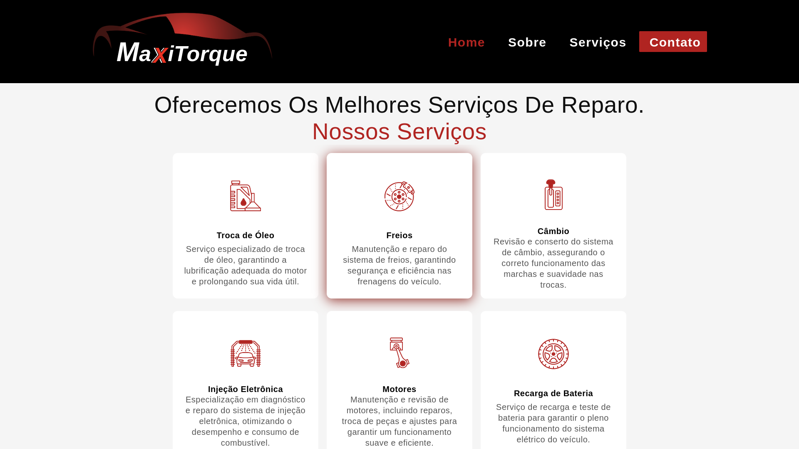
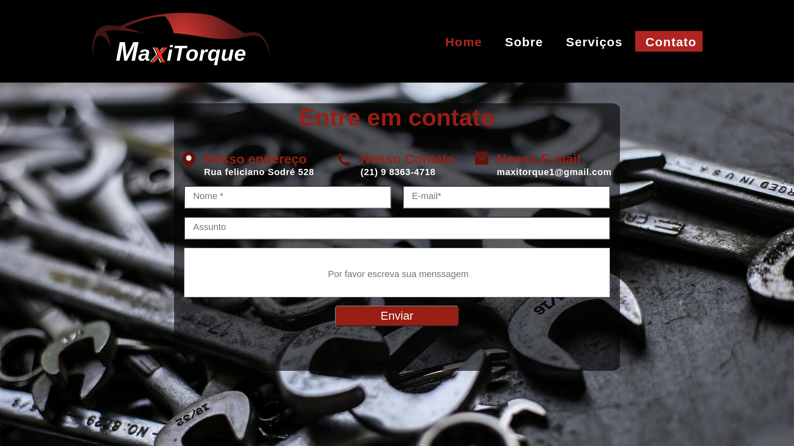

# MaxiTorque Diesel

Esta é uma **land page** para uma oficina mecânica. Ela fornece informações sobre a empresa, bem como a capacidade de navegar pelas diferentes seções do site e entrar em contato com a empresa por meio do formulário de contato.

## Funcionalidades

- **Navegação manual:** Os usuários podem rolar manualmente pela página para visualizar as diferentes seções.

- **Navegação pela nav bar:** Os usuários podem usar a navegação na barra de navegação no header para ir diretamente para uma seção específica.

- **Seções separadas:** O site é dividido em várias seções, cada uma fornecendo informações específicas sobre a empresa, serviços oferecidos, depoimentos de clientes, etc.

- **Formulário de contato:** Existe um formulário de contato onde os usuários podem enviar mensagens para a empresa. Os campos típicos de um formulário de contato incluem nome, e-mail, assunto e mensagem.

### Pré-requisitos

Navegador da web moderno

- 
- 
- 
- 
- 

### Como executar o projeto

1. Clone o repositório para o seu ambiente local:<https://github.com/marvindev2022/MaxiTorque>


git clone <<git@github.com>:marvindev2022/MaxiTorque.git>
Navegue até o diretório do projeto:


cd nome-do-repositorio
Abra o arquivo index.html em um navegador da web com o comando.

No terminal
```
npm install
```
Depois

No terminal
```
npm run dev

```

## Personalização
Você pode personalizar a land page de acordo com as necessidades da sua oficina mecânica. Aqui estão algumas áreas que você pode considerar:

Imagens e logotipo:


No header você tem a opção de navegar entres as seções com auxilio do nav bar


O home contem um carrosel de imagens


Na seção sobre pode conhecer um pouco sobre a empresa


Estes são os cards de serviços


Pensando em você criamos uma seção de contato

Formulário de contato: Configure o formulário de contato para enviar as mensagens para o endereço de e-mail correto da sua empresa.


Esse roda pe auxilia no retorno para seção desejada


Tecnologias utilizadas


[HTML5](https://img.shields.io/badge/html5-%23E34F26.svg?style=for-the-badge&logo=html5&logoColor=white)


## Contribuição
Contribuições são bem-vindas! Se você tiver sugestões de melhorias, sinta-se à vontade para enviar um pull request.


## Contato

Para qualquer dúvida ou suporte, você pode entrar em contato conosco pelo formulário de contato em nosso site ou pelos seguintes meios:


***E-mail***: <mavirolero@gmail.com>
***Telefone***: (21) 9 6464-2376

